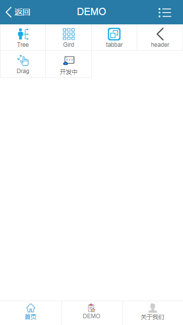

# 本基础组件仅用于自己开发使用

> A Vue.js project
## vue cil 配置
> LOOK



> less 和 sass 配置

``` bash
// vue cil 内置配置了less和sass，只需要安装几个使用
// sass 安装
npm install node-sass --save-dev
npm install sass-loader --save-dev

//less 安装
npm install less --save-dev
npm install less-loader --save-dev

// 安装成功以后使用：<style lang="sass/less"></style>即可
```

> 移动端flexible配置

``` bash
// 1、安装flexible

npm i lib-flexible --save

// 2、在项目入口文件main.js中引入lib-flexible


import 'lib-flexible/flexible.js'

// 3、在项目根目录的index.html 头部加入手机端适配的meta的代码

<meta name="viewport" content="width=device-width, initial-scale=1.0">

// 4、根据转换工具吧把px转为rem，（根元素设为设计图的1/10:750px---> fontSize: 75）

// 5、尽量使用sass函数转换rem，或者在vue中配置px2rem-loader（请自己配置）

<style lang="scss">
  $browser-default-font-size: 75px !default; // sass 跟聚设计图定义默认rem更元素，设计图的1/10
  //sass px 转rem函数
  @function px2rem($px){//$px为需要转换的字号
    @return $px / $browser-default-font-size * 1rem;
  }
  .tree {
    width: px2rem(750px);
    height: px2rem(1234px);
    border: solid 1px red;
    box-sizing: border-box;
  }
</style>
```

>点击延迟

```bash
npm install fastclick --save
```


> vue配置axios发送 ajax请求

``` bash
//1、安装

npm install axios --save

// 2、在main.js中

import axios from 'axios'

// 3、然后把axios注入到vue全局

 Vue.prototype.$axios = axios // 在组建中就可以这样使用 this.$axios

// 注： 为了兼容低版本浏览器，请引入· es6-promise

npm install es6-promise --save

require('es6-promise').polyfill()

```

> vue 开发环境时配置axios跨域,特别说明，仅用于开发环境的跨域，在config/index.js 下配置，要想生产环境也要跨域，建议使用jsonp 或者前后台一起配置

``` bash

proxyTable: {
  '/list': {
    target: 'http://api.xxxxxxxx.com',
    changeOrigin: true,
    pathRewrite: {
      '^/list': '/list'
    }
  }
}

```

> vue 递归组件中使用事件传递时，需要用bus 插件的支持，不然没有办法传递事件。

``` bash
$ npm install vue-bus

import Vue from 'vue';
import VueBus from 'vue-bus';

Vue.use(VueBus);

// 父组件 监听事件和清除监听

created() {
  this.$bus.on('add-todo', this.addTodo);
  this.$bus.once('once', () => console.log('这个监听器只会触发一次'));
},
beforeDestroy() {
  this.$bus.off('add-todo', this.addTodo);
},
methods: {
  addTodo(newTodo) {
    this.todos.push(newTodo);
  }
}

// 子组件
methods: {
  addTodo() {
    this.$bus.emit('add-todo', { text: this.newTodoText });
    this.$bus.emit('once');
    this.newTodoText = '';
  }
}
```

## Build Setup

``` bash
# install dependencies
npm install

# serve with hot reload at localhost:8080
npm run dev

# build for production with minification
npm run build

# build for production and view the bundle analyzer report
npm run build --report

# run unit tests
npm run unit

# run e2e tests
npm run e2e

# run all tests
npm test
```

For a detailed explanation on how things work, check out the [guide](http://vuejs-templates.github.io/webpack/) and [docs for vue-loader](http://vuejs.github.io/vue-loader).
