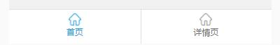

## 底部导航栏组件开发

>示例图



> props 说明

| name         | type   | value    |  explain    |
| --------     | -----: | :----:   | :----:      |
| tabbarConfig | Array  | 下面例子  | 请看下面注释  |

``` bash
tabbarConfig: {
  type: Array,
  default: function () {
    return [{
      title: '首页', # tabbar 标题
      default: true, # 默认当前显示页，false,不显示
      link: '', # 对应的页面路径
      name: 'Demo', # 对应的页面name
      query: {}, # 跳转页面时需要的参数配置
      enterSrc: '../../../static/images/tabbar/home-enter.png', #选中显示的图标
      leaveSrc: '../../../static/images/tabbar/home-leave.png', #离开显示的图标
      enterColor: '#1296db', #进入字体颜色设置
      leaveColor: '#707070' #离开字体颜色设置
    }]
  }
}
```

> slot 变量配置 暂时slot变量只支持tabbarItem0/tabbarItem1，如:

```bash
<tarbar @on-change ="tabChange">
  <div :slot="`tabbarItem${i}`" v-for="i in [0,1,2]" :key="i">11</div>
</tarbar>
```

>sass 变量说明

```bash
@import '../../style/config.base.scss'; # 公共样式引入
$position-type: absolute; # 定位类型，#app定义了width： 100%，height: 100%,时用的，如果没有定义，请自己定义为position：fixed；
$tabbar-height: 100px; # tabbar 高度定义
$tabbar-border-color: #e0e0e0;
$tabbar-border:linear-gradient(90deg, transparent 50%, $tabbar-border-color 50%); # 左右边框0.5px
$tabbar-top-border-color: linear-gradient(0deg, transparent 50%, $tabbar-border-color 50%); # 上下边框0.5px;
$tabbar-border-width: 1px; # 边框宽度
$tabbar-icon-width: 20px; # 图标宽度
$tabbar-font-size: 14px; # 字体大小
```


>events : on-change(e)

```bash
@on-change(e) #点击每个菜单栏后出发的事件，返回参数：此菜单信息
```
