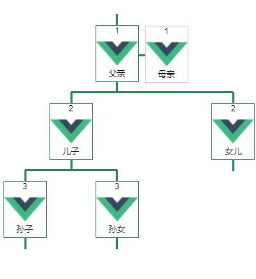

## 家谱类树形递归组件

> 实例图



* 特别说明，调用此组件，需要 vue-bus插件支持


> props： nodeData ，如：
```bash
  {
    child: [
      {
        id: 0,
        sex: 1, # 性别
        name: '父亲', # 姓名
        portrait: '', # 头像
        title: 1,
        child: [
          {
            id: 2,
            sex: 1, # 性别
            name: '儿子', # 姓名
            portrait: '', # 头像
            title: 2,
            child: [
              {
                id: 4,
                sex: 1, # 性别
                name: '孙子', # 姓名
                portrait: '', # 头像
                title: 3,
                child: [],
                spouse: []
              }, {
                id: 5,
                sex: 2, # 性别
                name: '孙女', # 姓名
                portrait: '', # 头像
                title: 3,
                child: [],
                spouse: []
              }
            ],
            spouse: []
          }, {
            id: 3,
            sex: 2, # 性别
            name: '女儿', # 姓名
            portrait: '', # 头像
            title: 2,
            child: [],
            spouse: []
          }
        ],
        spouse: [{
          id: 2,
          sex: 2, # 性别
          name: '母亲', # 姓名
          portrait: '', # 头像
          title: 1
        }]
      }
    ]
  }
```

>scss 变量说明

| name          | default                  |   explain      |
| --------      |  -----:                  | :----:        |
|$titleBakColor  | #b1b1b1 | 标题背景色 |
|$treeBorderColor  | seagreen | 连线边框 |
|$itemBackgroundColor  | #fff | 节点基础背景色 |

>events: tap-father(e),tap-mather(e)

| name         | params | explain     |
| --------     | -----: | :----:      |
| on-click    | value  |   点击节点触发的事件，返回节点信息（value）|

>demo code
```bash
<template>
  <div class="tree" >
    <treenode  @on-click="tapTreeItem"></treenode>
  </div>
</template>

<script>
import treenode from '../../components/tree/tree'

export default {
  name: 'Tree',
  components: {
    treenode: treenode
  },
  data () {
    return {
    }
  },
  created () {
    this.$bus.on('on-click', this.tapTreeItem)
  },
  beforeDestroy () {
    this.$bus.off('on-click', this.tapTreeItem)
  },
  methods: {
    tapTreeItem (e) {
      console.log(e)
    }
  }
}
</script>

<!-- Add "scoped" attribute to limit CSS to this component only -->
<style lang="scss">
@import '../../style/config.base.scss';
  .tree {
    padding: 40px;
    height: 100%;
    overflow: scroll;
    box-sizing: border-box;
    zoom: 1;
  }
</style>
```
